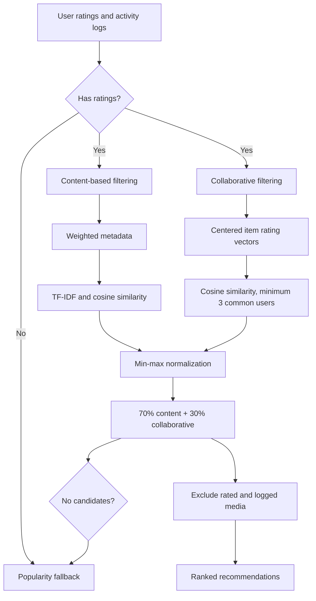
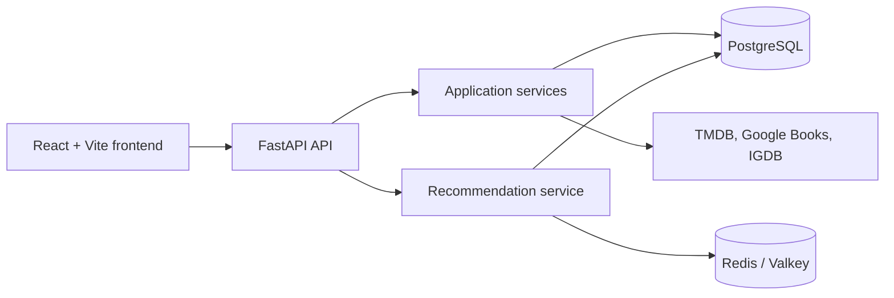
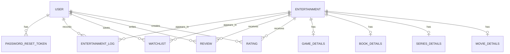

# Reckond

Reckond is a full-stack entertainment discovery and tracking platform for movies, TV series, games, and books. It combines provider-backed search and import workflows with watchlists, ratings, reviews, activity logs, and personalized recommendations.

The project is built as a React/Vite frontend backed by a FastAPI API, PostgreSQL through SQLAlchemy, and a hybrid recommendation engine with Redis/Valkey caching.

## Features

### Authentication

- User registration and OAuth2 password-form login.
- JWT access tokens and refresh tokens.
- Bcrypt password hashing.
- Authenticated user, rating, review, watchlist, activity-log, and recommendation endpoints.
- Password-reset token model exists, but password-reset routes and service logic are not implemented.

### Entertainment

- Browse imported media with pagination and media-type filtering.
- Search external providers for movies, series, books, and games.
- Import provider metadata into the local catalog.
- View normalized media details, posters, backdrops, release dates, languages, and type-specific metadata.

### Personal tracking

- Add and remove media from a personal watchlist.
- Create or update ratings from 1 to 10.
- Write, update, and delete reviews.
- Log activities such as watching, completing, playing, or reading.
- View profile summaries, ratings, reviews, and activity history through the frontend.

### Recommendations

- Hybrid content-based and collaborative recommendations.
- Content features built from media metadata and represented with TF-IDF vectors.
- Item-based collaborative filtering over centered user-rating vectors.
- Min-max normalization followed by a 70% content and 30% collaborative score.
- Popularity fallback for users without ratings or when the hybrid pipeline produces no candidates.
- Recommendations exclude media already rated or logged by the current user.

### Infrastructure

- FastAPI-generated OpenAPI documentation.
- SQLAlchemy models with PostgreSQL support.
- Redis/Valkey-backed JSON recommendation cache.
- Alembic migration files are present, but the current migration history is incomplete; see [Development Status](#development-status).

## Recommendation Engine



### Content-based filtering

`backend/app/recommendation/feature_builder.py` builds a weighted text representation for each imported item. The current fields are:

- All media: title and description.
- Movies and series: genres, keywords, cast, and crew.
- Series: series type and animation type.
- Books: authors and publisher.
- Games: platforms.

The implementation repeats fields to apply weights, then uses `TfidfVectorizer(stop_words="english")` and cosine similarity. Title, genres, keywords, cast, crew, authors, publisher, and platforms receive the weights defined in the feature builder; descriptions are included with their default weight.

The TF-IDF feature data is held in a process-global in-memory cache and rebuilt when the ordered set of media IDs changes.

### Collaborative filtering

Ratings are represented as an item-to-user matrix. For each item pair, the implementation compares ratings from common users after subtracting each user's average rating. At least three common users are required for a non-zero cosine similarity. For a user's recommendations, only items they rated 7 or higher contribute to the collaborative score, and only users who rated at least one of the user's rated items are considered.

### Hybrid scoring and cold start

Content and collaborative scores are each min-max normalized when there is a score range, then combined as:

```text
hybrid_score = 0.7 * normalized_content + 0.3 * normalized_collaborative
```

Users with no ratings receive popularity recommendations. The same fallback is used when a user has ratings but the hybrid pipeline produces no candidate items. Popularity is ordered by rating count and then average rating, while already rated or logged media is excluded.

## Architecture



The frontend uses hash-based client-side routing rather than a router package. The API layer delegates provider and business operations to services, while SQLAlchemy models provide the persistence layer and recommendation modules query the same database.

Implemented frontend routes include:

- `#/` for the home and popular-media view, with `?type=movie|series|book|game` filtering.
- `#/search?query=...` for provider-backed search results.
- `#/media/{id}` for media details and interaction controls.
- `#/watchlist` for saved media.
- `#/profile` for ratings, reviews, and activity summaries.
- `#/login` and `#/register` for authentication.

## Backend Architecture

```text
backend/
├── app/
│   ├── api/routers/       HTTP endpoints grouped by domain
│   ├── core/              Settings, JWT security, Redis, and cache helpers
│   ├── database/          SQLAlchemy engine and database dependencies
│   ├── models/             SQLAlchemy users, media, and interaction models
│   ├── recommendation/    Content, collaborative, popularity, and hybrid logic
│   ├── schemas/            Pydantic request and response models
│   ├── services/           User, media, search, and interaction business logic
│   │   └── providers/      TMDB, Google Books, and IGDB integrations
│   └── utils/              Media response serialization
├── alembic/                Migration configuration and revisions
├── requirements.txt
└── reset_db.py
```

- `api/routers` exposes the HTTP contract and authentication dependencies.
- `services` coordinates provider calls, imports, users, and user interactions.
- `models` defines the SQLAlchemy persistence model.
- `schemas` defines validated API input and output shapes.
- `recommendation` contains the scoring pipeline and popularity fallback.
- `core` centralizes environment settings, token handling, and cache access.

## Database Design

The database uses `Entertainment` as the common media root. Its supported types are movie, series, book, and game, with one-to-one type-specific detail records:



Important modeled data includes:

- Users and password-reset token records.
- Shared entertainment metadata such as title, description, artwork, release date, language, media type, external ID, and external source.
- Movie details including runtime, budget, revenue, genres, keywords, cast, and crew.
- Series details including series type, animation type, seasons, episodes, genres, keywords, cast, and crew.
- Book details including ISBN, page count, publisher, and authors.
- Game details and linked platforms.
- Ratings, reviews, watchlist entries, and entertainment activity logs.

Ratings, reviews, and watchlist entries enforce one record per user/media pair. Entertainment records are deduplicated by `(external_source, external_id)`. Interaction foreign keys use cascade deletes where defined.

## External API Providers

Provider-specific logic is isolated under `backend/app/services/providers/` and is selected by the media type:

| Provider | Media | Current use |
|---|---|---|
| TMDB | Movies and TV series | Search and import metadata, artwork, dates, languages, genres, keywords, cast, and selected crew |
| Google Books | Books | Search and import book metadata, thumbnails, publication data, ISBNs, pages, publisher, and authors |
| IGDB via Twitch OAuth | Games | Obtain an application token, search, and import game summaries, covers, release dates, and platforms |

TMDB requests use retry handling for connection and timeout failures. The current movie-search implementation disables TLS certificate verification, which should be corrected before production use.

## Redis / Valkey

Redis-compatible storage is used for the recommendation response cache. `REDIS_URL` takes precedence over `VALKEY_URL`; the default is `redis://localhost:6379/0`.

```text
GET /recommendations/for-you
				│
				▼
recommendations:v1:user:{user_id}
				│
	 ┌────┴────┐
	 │         │
	HIT       MISS
	 │         │
 response  recommendation engine
						 │
						 ▼
			 JSON cache write
```

- Cache entries use `recommendations:v1:user:{user_id}`.
- The default TTL is 300 seconds and is configurable with `RECOMMENDATION_CACHE_TTL`.
- Redis errors are logged and treated as cache misses or failed writes; the application does not intentionally fail startup when Redis is unavailable.
- Rating and entertainment-log mutations invalidate a user's recommendation entry.
- Watchlist, review, and media-import mutations currently do not invalidate that entry.

## API Endpoints

The API is mounted without a global version prefix. Protected endpoints use `Authorization: Bearer <access-token>`.

### Authentication and users

| Method | Path | Description |
|---|---|---|
| `POST` | `/auth/` | Register a user |
| `POST` | `/auth/login` | Authenticate with an OAuth2 password form and return access/refresh tokens |
| `POST` | `/auth/refresh` | Exchange a refresh token for a new token pair |
| `GET` | `/users/` | List users |
| `GET` | `/users/me` | Return the authenticated user |
| `GET` | `/users/{user_id}` | Return a user by ID |

### Media

| Method | Path | Description |
|---|---|---|
| `GET` | `/media/` | List local media with optional type, offset, and limit filters |
| `GET` | `/media/search` | Search a provider for a required query and media type |
| `POST` | `/media/import` | Import a provider item by external ID and media type |
| `GET` | `/media/{media_id}` | Return local media details |

### Personal interactions

| Method | Path | Description |
|---|---|---|
| `POST` / `GET` | `/watchlist/` | Add to or list the authenticated user's watchlist |
| `DELETE` | `/watchlist/{entertainment_id}` | Remove an item from the watchlist |
| `POST` / `GET` | `/ratings/` | Create/update a rating or list the user's ratings |
| `GET` | `/ratings/{entertainment_id}` | Get a rating for one item |
| `DELETE` | `/ratings/{entertainment_id}` | Delete a rating |
| `POST` / `GET` | `/reviews/` | Create a review or list the user's reviews |
| `GET` | `/reviews/{entertainment_id}` | Get a review for one item |
| `PUT` | `/reviews/{entertainment_id}` | Update a review |
| `DELETE` | `/reviews/{entertainment_id}` | Delete a review |
| `POST` / `GET` | `/logs/` | Create or list entertainment activity logs |
| `GET` | `/logs/{log_id}` | Get one activity log |
| `PUT` | `/logs/{log_id}` | Update an activity log |
| `DELETE` | `/logs/{log_id}` | Delete an activity log |

### Recommendations

| Method | Path | Description |
|---|---|---|
| `GET` | `/recommendations/for-you` | Return up to 10 personalized recommendations for the authenticated user |

## Tech Stack

| Layer | Technology |
|---|---|
| Frontend | React 19, React DOM, Vite 8, ESLint |
| Backend | FastAPI, Uvicorn |
| API models | Pydantic 2 |
| Database | PostgreSQL via `psycopg2-binary` |
| ORM | SQLAlchemy 2 |
| Migrations | Alembic files are present but incomplete |
| Authentication | `python-jose` JWT and Passlib bcrypt |
| Recommendation | Python, scikit-learn, NumPy/SciPy |
| Cache | Redis Python client with Redis/Valkey URL support |
| External APIs | TMDB, Google Books, IGDB/Twitch OAuth |

## Project Structure

```text
Reckond/
├── backend/
│   ├── app/
│   │   ├── api/routers/
│   │   ├── core/
│   │   ├── database/
│   │   ├── models/
│   │   ├── recommendation/
│   │   ├── schemas/
│   │   ├── services/providers/
│   │   └── utils/
│   ├── alembic/
│   ├── requirements.txt
│   └── reset_db.py
└── frontend/
		└── entertainment-system/
				├── public/
				├── src/
				│   ├── components/
				│   ├── hooks/
				│   ├── pages/
				│   └── services/
				├── package.json
				└── vite.config.js
```

## Setup

### Prerequisites

- Python compatible with the pinned backend dependencies.
- Node.js and npm.
- PostgreSQL.
- Redis or Valkey for recommendation caching. The API can start if it is unavailable, but recommendation cache reads and writes will be skipped.
- Credentials for the three external provider integrations.

### Clone

```bash
git clone https://github.com/NeerajMhetras/Reckond.git
cd Reckond
```

### Backend

```bash
cd backend
python -m venv .venv
source .venv/bin/activate
pip install -r requirements.txt
```

Create `backend/.env` with the variables below, then make sure PostgreSQL is running and `DATABASE_URL` points to the target database.

```bash
uvicorn app.main:app --reload
```

The FastAPI entrypoint imports the models and currently calls `Base.metadata.create_all(bind=engine)` at import time. This is the currently implemented schema initialization path.

### Environment variables

| Variable | Required | Description |
|---|---:|---|
| `SECRET_KEY` | Yes | JWT signing secret |
| `DATABASE_URL` | Yes | PostgreSQL SQLAlchemy connection URL |
| `TMDB_API_KEY` | Yes | TMDB API key |
| `GOOGLE_BOOKS_API_KEY` | Yes | Google Books API key |
| `IGDB_CLIENT_ID` | Yes | IGDB client ID |
| `IGDB_CLIENT_SECRET_KEY` | Yes | Twitch/IGDB client secret |
| `REDIS_URL` | No | Redis connection URL; takes precedence over `VALKEY_URL` |
| `VALKEY_URL` | No | Redis-compatible connection URL, default `redis://localhost:6379/0` |
| `RECOMMENDATION_CACHE_TTL` | No | Recommendation cache TTL in seconds, default `300` |
| `ALGORITHM` | No | JWT algorithm, default `HS256` |
| `ACCESS_TOKEN_EXPIRE_MINUTES` | No | Access-token lifetime, default `30` |
| `REFRESH_TOKEN_EXPIRE_DAYS` | No | Refresh-token lifetime, default `7` |

### Database and cache

The repository includes Alembic configuration and revisions, but the initial migration is a no-op and the migration chain is not currently a reliable fresh-database bootstrap. Use the application's `create_all()` behavior for the current development setup, or review and repair the migration history before relying on `alembic upgrade head`.

For a local Redis-compatible service, configure the URL in `.env` and verify it independently, for example:

```bash
redis-cli ping
```

The expected response is `PONG` when the service is available. The repository does not include Docker Compose or a deployment configuration.

### Frontend

```bash
cd frontend/entertainment-system
npm install
npm run dev
```

The frontend uses `VITE_API_BASE_URL` for the API base URL and defaults to `http://localhost:8000`.

Available package scripts are:

```bash
npm run dev
npm run build
npm run lint
npm run preview
```

## API Documentation

FastAPI's generated documentation is available when the backend is running:

- `http://localhost:8000/docs`
- `http://localhost:8000/redoc`
- `http://localhost:8000/openapi.json`

## Example Recommendation Response

The recommendation endpoint returns a list of objects with a serialized `media` object and a numeric `score`:

```json
[
	{
		"media": {
			"id": 123,
			"title": "Example title",
			"description": "Example description",
			"poster_url": null,
			"backdrop_url": null,
			"release_date": null,
			"media_type": "movie",
			"language": "en",
			"external_id": "example-id",
			"external_source": "TMDB",
			"details": null
		},
		"score": 0.82
	}
]
```

The values above are illustrative; the field names and response shape follow `RecommendationResponse` and `MediaResponse`.

## Performance

Recommendation responses are cached in Redis/Valkey with a configurable five-minute default TTL. The TF-IDF representation is also reused in process memory until the ordered media ID list changes. No benchmark data is currently published.

## Security

- Passwords are hashed with bcrypt through Passlib.
- JWTs are signed with the configured secret and algorithm.
- Access and refresh tokens carry separate token-type claims and are validated by the corresponding code paths.
- Authenticated routes resolve the user after access-token validation.
- Secrets and provider credentials are loaded from environment-backed settings rather than committed values.

Current limitations include stateless, non-revocable refresh tokens, no rate-limiting implementation, and the TMDB movie-search request's disabled TLS verification. Password-reset persistence exists as a model, but the user-facing reset flow is not implemented.

## Screenshots

No screenshots are currently committed. The frontend does include a hero image asset, but it is not presented here as a product screenshot.

## Development Status

### Implemented

- React/Vite frontend for discovery, search, media details, authentication, watchlists, ratings, reviews, activity logs, profiles, and recommendations.
- FastAPI endpoints for the implemented user and media workflows.
- TMDB, Google Books, and IGDB provider integrations.
- Hybrid recommendation scoring and Redis/Valkey recommendation caching.

### In progress or incomplete

- Alembic migrations do not yet provide a dependable fresh-database setup.
- Password-reset model exists without password-reset API/service/frontend flows.
- Conventional automated recommendation test coverage is not established; the `test_*.py` files in the recommendation package are executable scripts rather than a documented pytest suite.
- Cache invalidation is not connected to watchlist, review, or media-import mutations.

### Planned improvements

- Repair and verify the migration history.
- Add recommendation evaluation metrics, broader automated tests, and better cold-start and diversity handling.
- Add a complete password-reset workflow and refresh-token revocation strategy.
- Add production deployment documentation and provider/API health monitoring.

## License

No license file is currently present in the repository.
